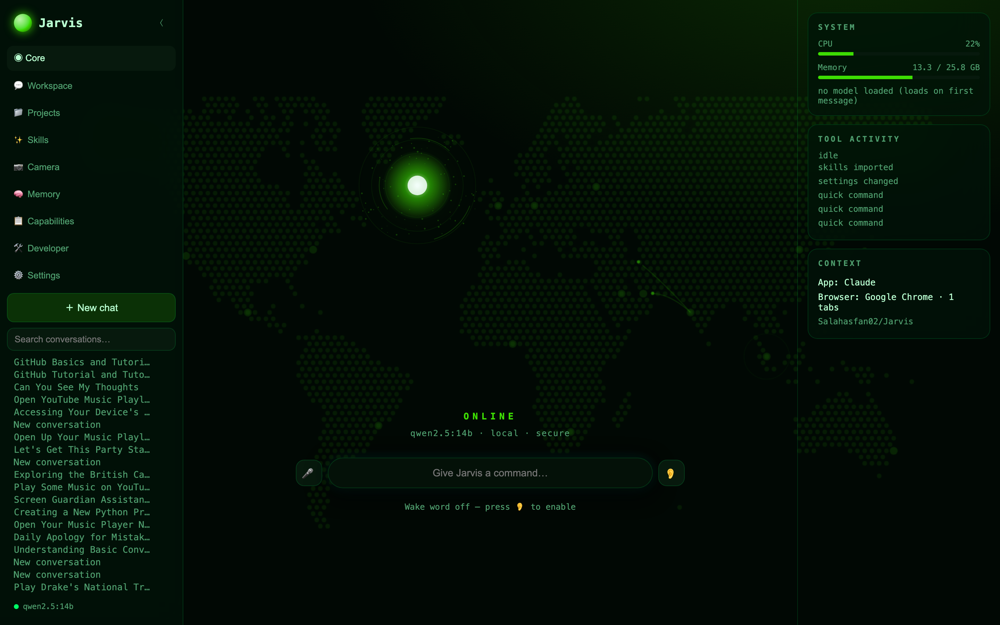
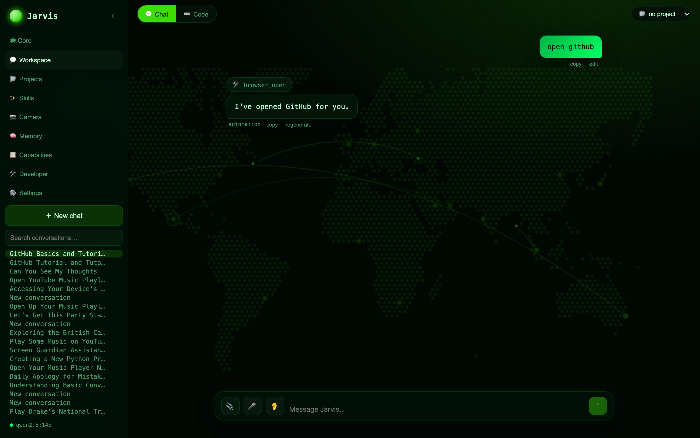
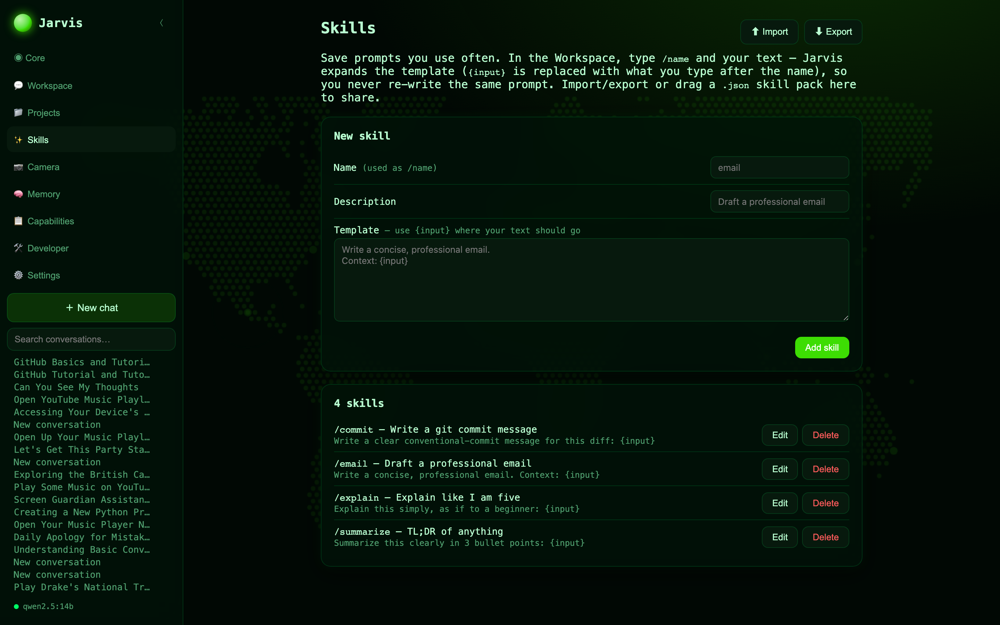
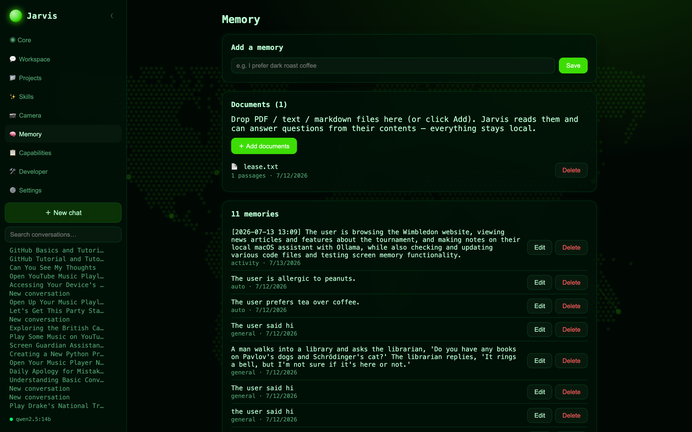
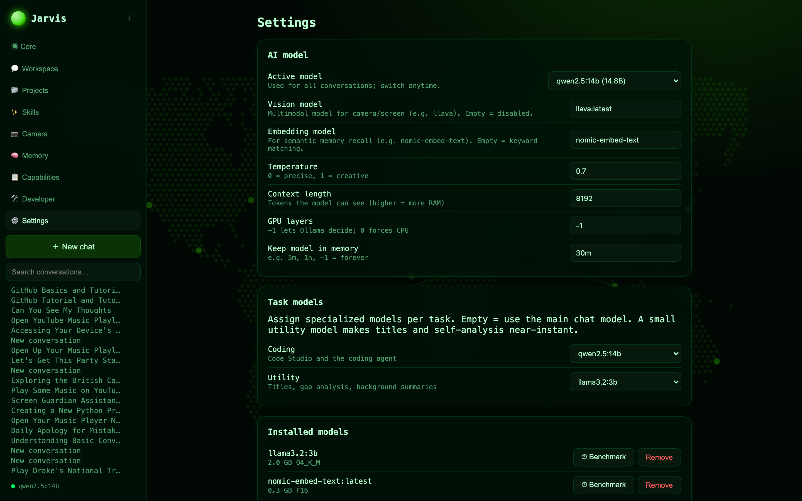
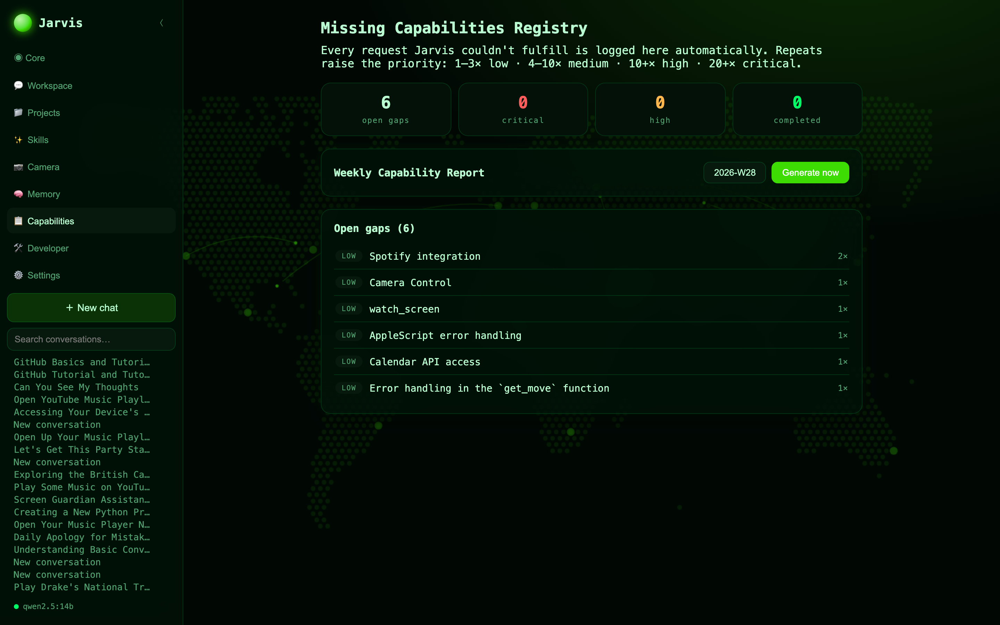

<div align="center">

# 🟢 Jarvis

### A private, local AI operating system for your Mac.

**Voice. Vision. Automation. Memory. 100% on your machine — no cloud, no API keys, no subscriptions.**

Jarvis turns your MacBook into the AI assistant from the movies: talk to it, let it see your screen and camera, control your apps, remember everything about you, and get real work done — all powered by local LLMs through [Ollama](https://ollama.com). Nothing ever leaves your Mac.

[](#requirements)
[](#requirements)
[](#tech-stack)
[](https://ollama.com)
[](#-why-jarvis)
[](LICENSE)

**⭐ If this looks cool, star the repo — it genuinely helps.**

<br/>



</div>

---

## 🧠 Why Jarvis?

Every AI assistant wants your data in the cloud. Jarvis doesn't.

- **🔒 Totally private** — runs on local models via Ollama. No accounts, no API keys, no telemetry. Your conversations, screen, camera, files, and memories never leave your machine.
- **🎙️ Voice-first** — say *"Jarvis…"* and it wakes up (with a chime), listens with **offline Whisper**, and replies in a **human neural voice**. Have a real back-and-forth conversation, hands-free.
- **👁️ It can actually see** — reads your screen with Apple's OCR, watches through your camera, and answers questions about whatever's in front of you.
- **🦾 It does things** — opens apps, controls your browser, plays music, drafts emails, manages files, runs code — with a permission prompt before anything touches your system.
- **🧩 It's an OS, not a chatbot** — a living command-center dashboard with agents, projects, long-term memory, and a plugin system it can extend *itself*.
- **🆓 Free & source-available** — free for any **noncommercial** use. Fork it, hack it, make it yours.

---

## 📸 Screenshots

<div align="center">

**The Core** — a reactive command center, not a chat box


**Unified Workspace** — chat and code in one place, with runnable code blocks and live tool calls


</div>

| Custom Skills | Long-term Memory |
|:---:|:---:|
|  |  |

| Model & Voice Settings | Self-Improvement Registry |
|:---:|:---:|
|  |  |

---

## ✨ What it can do

<table>
<tr>
<td width="50%" valign="top">

### 🎙️ Voice
- Wake word (*"Jarvis…"*) with an audible chime
- **Offline speech recognition** (Whisper) — works in any browser
- **Human-sounding neural voices** (Kokoro TTS)
- Sentence-streaming replies (talks as it thinks)
- Conversation mode — reply without repeating the wake word

### 👁️ Vision
- Read the **exact text** on your screen (Apple Vision OCR)
- **Live camera** — ask about what it sees
- **Screen watch** — "tell me when the download finishes"
- **Screen memory** — auto-journals what you're working on

### 🦾 Mac Automation
- Open/close apps, control windows, notifications, clipboard
- **Browser agent** — reuses your tabs, never spams windows
- Play **YouTube** & **Apple Music**, manage playlists
- **Notes, Reminders, Calendar** — read and create
- Draft **iMessage & Email** (you press send)

</td>
<td width="50%" valign="top">

### 🧑‍💻 Developer Workspace
- Unified **Chat + Code** modes
- **Run code in a sandbox** — Python, JS/TS, C/C++, Go, Rust, Java
- Multi-file projects, package installs, **live HTML preview**
- Senior-engineer coding agent (review, refactor, tests, docs)

### 🧠 Memory & Knowledge
- **Long-term memory** — remembers your preferences & projects
- **Auto-capture** — learns facts as you talk (toggleable)
- **Document RAG** — drop in PDFs/Word/Excel and ask about them
- **Projects** — per-project memory across conversations

### 🕵️ Research
- Live web search + page reading with **mandatory citations**
- Scoped search: GitHub, Stack Overflow, Reddit, arXiv, YouTube

### 🤖 Intelligence
- **Auto-routing agents** (research, coding, media, vision…)
- **Multi-step task planner** with a live checklist
- **Custom Skills** — save prompts, invoke with `/name`, import/export
- **Self-improving** — logs what it can't do and can write its own tools
- **Multi-model** — assign models per task, benchmark them

</td>
</tr>
</table>

### 🖥️ Menu-bar Quick Command
Hit **⌥Space** from *any* app to summon a floating command bar — ask about what's on your screen, get an answer, and get back to work without switching windows.

### ☀️ Daily Briefing
*"Jarvis, give me my daily briefing"* → live weather, today's calendar, and your reminders, narrated.

---

## 🚀 Quick Start

```bash
# 1. Install Ollama and pull a model (https://ollama.com/download)
ollama pull qwen2.5:14b

# 2. Clone
git clone https://github.com/Salahasfan02/Jarvis.git
cd Jarvis

# 3. Run everything with one command
chmod +x start.sh && ./start.sh
```

That's it — your browser opens at **http://localhost:5173** and Jarvis is live. Press **Ctrl+C** (or `./stop.sh`) to turn it off. Nothing auto-starts; it only runs when you start it.

<details>
<summary><b>Prefer the native desktop app?</b></summary>

```bash
cd desktop
npm install
npm start          # or: npm run package  → builds Jarvis.app
```
The desktop app adds a menu-bar icon, the **⌥Space** quick command, a **⌘⇧J** floating window, and "Open at Login."
</details>

<details>
<summary><b>Run each piece manually</b></summary>

```bash
# Terminal 1 — Ollama
ollama serve

# Terminal 2 — backend
cd backend && python3 -m venv .venv && .venv/bin/pip install -r requirements.txt
.venv/bin/python run.py            # → http://127.0.0.1:8765

# Terminal 3 — UI
cd frontend && npm install && npm run dev   # → http://localhost:5173
```
</details>

### Level up (optional, all local)
```bash
ollama pull nomic-embed-text   # semantic memory + smarter agent routing
ollama pull llava              # camera & screen vision
```
Then open **Settings** to enable them, download the offline **Whisper** and human **Kokoro** voice models, pick your theme, and set your wake word.

---

## 📋 Requirements

| | |
|---|---|
| **OS** | macOS on Apple Silicon (built & tested on an M-series Mac) |
| **[Ollama](https://ollama.com)** | with at least one model (e.g. `qwen2.5:14b`) |
| **Python** | 3.11+ |
| **Node.js** | 18+ |
| **RAM** | 16 GB minimum, 24 GB+ recommended for larger models |

> 💡 **Model tip:** `qwen2.5:14b` is the sweet spot for tool-calling on a 16–24 GB Mac. The app is fully model-agnostic — switch models anytime in Settings, and even benchmark them on your hardware.

---

## 🔐 Security & Privacy

Jarvis is built to earn your trust:

- **Runs 100% locally** — the only network calls are the web-search tools *you* invoke.
- **Permission system** — every action has a risk level. Safe actions run instantly; anything that touches your system (shell, AppleScript, deleting files) asks first, every time.
- **Audit log** — every tool call, confirmation, and denial is recorded.
- **You always press send** — messages and emails are only ever *drafted*.
- **Sandboxed code** — generated code runs with no network and confined file access.

---

## 🏗️ Tech Stack

**Backend:** FastAPI · Ollama · SQLite · faster-whisper (STT) · Kokoro (TTS) · Apple Vision (OCR) · pyobjc
**Frontend:** React · TypeScript · Vite
**Desktop:** Electron (tray, global hotkeys, floating window)

Modular by design — new tools, agents, models, and integrations drop in without touching the core. See [`docs/architecture.md`](docs/architecture.md).

---

## 🗺️ Roadmap

- [ ] Encrypted memory & conversation storage
- [ ] First-run setup wizard (auto-pulls the right models)
- [ ] Self-contained `.app` (bundled backend)
- [ ] Meeting transcription with speaker separation
- [ ] Git integration in the coding workspace
- [ ] Community skill & plugin packs

---

## 🤝 Contributing

PRs, ideas, and bug reports are welcome. Jarvis is designed to be extended — writing a new tool or plugin is a few lines of Python (see [`docs/architecture.md`](docs/architecture.md)).

## ⭐ Star it

If Jarvis is useful or just fun to poke at, **drop a star** — it helps other people find it and keeps the project going.

## 📄 License

[PolyForm Noncommercial 1.0.0](LICENSE) — **free for any noncommercial use**: personal projects, hobby, research, education, and nonprofits. You can use, modify, and share it freely — just not sell it or use it commercially. Commercial use requires a separate license from the author.

<div align="center">
<br/>
<b>Built for people who want a real AI assistant — without giving their life to the cloud.</b>
</div>
